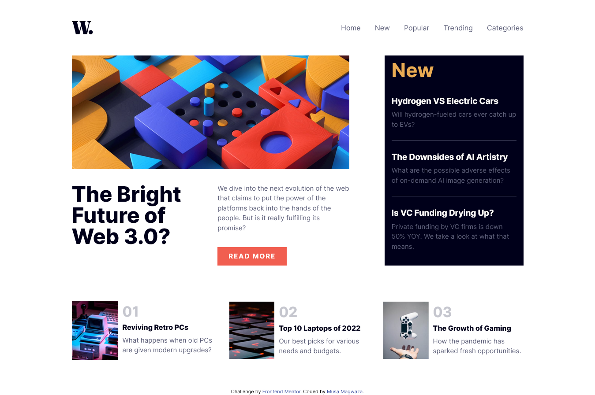

# Frontend Mentor - News homepage solution

This is a solution to the [News homepage challenge on Frontend Mentor](https://www.frontendmentor.io/challenges/news-homepage-H6SWTa1MFl). Frontend Mentor challenges help you improve your coding skills by building realistic projects. 

## Table of contents

- [Overview](#overview)
  - [The challenge](#the-challenge)
  - [Screenshot](#screenshot)
  - [Links](#links)
- [My process](#my-process)
  - [Built with](#built-with)
  - [What I learned](#what-i-learned)
  - [Continued development](#continued-development)
  - [Useful resources](#useful-resources)
- [Author](#author)
- [Acknowledgments](#acknowledgments)

## Overview

### The challenge

Users should be able to:

- View the optimal layout for the interface depending on their device's screen size
- See hover and focus states for all interactive elements on the page

### Screenshot

This is my solution

### Links

- Solution URL: [Add solution URL here](https://your-solution-url.com)
- Live Site URL: [Add live site URL here](https://your-live-site-url.com)

## My process

### Built with

- Semantic HTML5 markup
- CSS custom properties
- SASS
- Flexbox
- CSS Grid
- Mobile-first workflow

### What I learned

Thanks to [A Modern CSS Reset](https://andy-bell.co.uk/a-modern-css-reset/) I learned its easier to use images as block elements 😄😄

### Continued development

Going forward I want to continue using CSS grid and CSS animations as I am still not comfortable with them.

### Useful resources

- [A Modern CSS Reset](https://andy-bell.co.uk/a-modern-css-reset/) - This helped me with CSS resets. I really liked this pattern and will use it going forward.

## Author

- Website - [Musa Magwaza](https://www.your-site.com)
- Frontend Mentor - [@itsmusa](https://www.frontendmentor.io/profile/itsmusa)
- Twitter - [@flawedgoat](https://www.twitter.com/flawedgoat)
